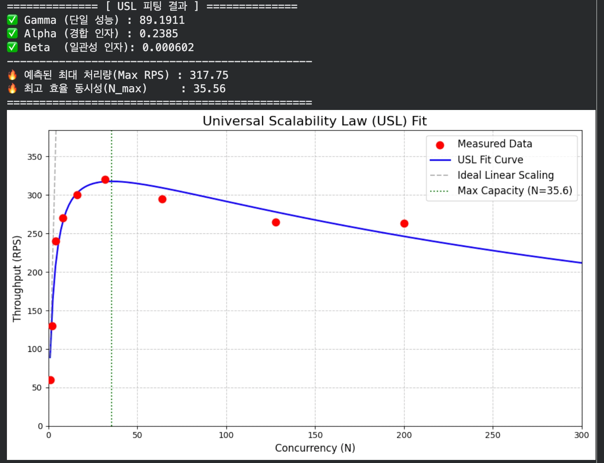
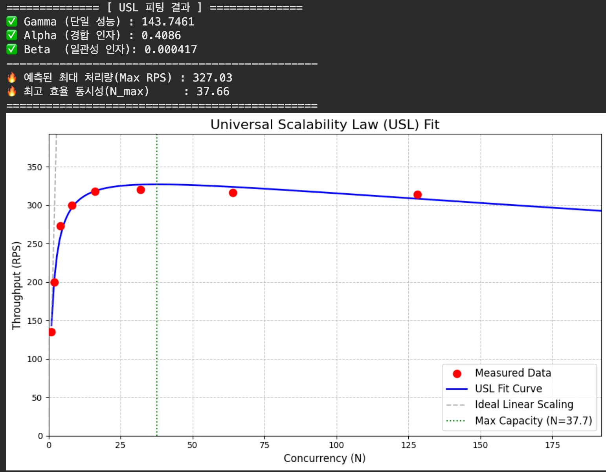
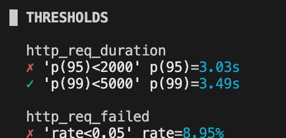
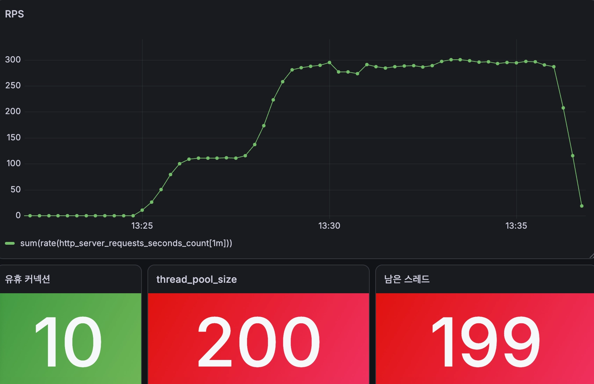
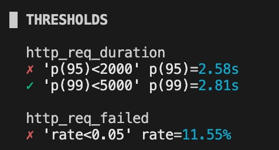
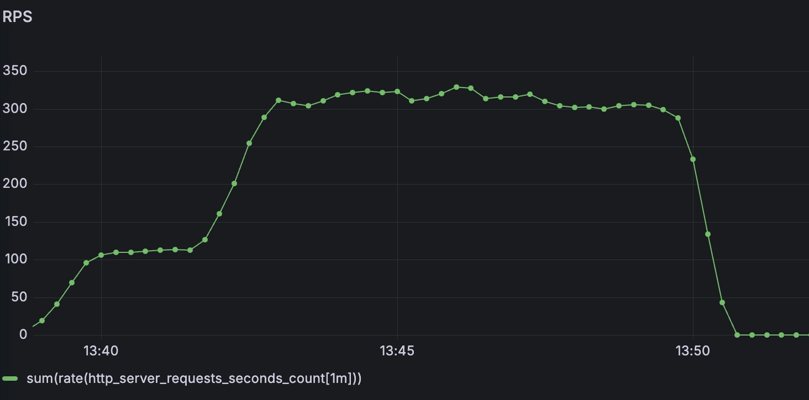

# John Community Project Backend

## Back-end 소개
- 사용자들이 팟캐스트 및 VOD 동영상을 스트리밍으로 시청하며 자유롭게 토론하고 대화하는 커뮤니티 서비스입니다.

### Front end
- <a href="https://https://github.com/100-hours-a-week/4-john-community-FE">Front-end Github</a>
---

## 핵심 기술적 문제 해결

### 1.1 USL 모델링 기반 스레드/커넥션 풀 사이즈 최적화.

    스레드 풀/커넥션 풀 사이즈 최적화에 있어서 보다 명확한 수학적 근거에 기반해서 최적화를 진행하였습니다.

- 문제제기
    k6를 활용하여 부하테스트를 해보았을 때, 스프링 부트 서버의 스레드 풀의 스레드를 모두 사용하지 않고 유휴 스레드들이 발생하는 문제를 발견하였습니다.
    이것이 계기가 되어서 최적의 스레드 풀 및 커넥션 풀 사이즈를 수학적 접근을 통해서 명확하게 최적화를 진행하고자 했습니다.

- USL(Universal Scalability Law)
  동시 접속자가 증가할 때 발생하는 **자원 경합(Contention)**과 **동기화 오버헤드(Coherency)**를 수치화하여, '최대 처리량(Max Throughput)'을 수학적으로 예측하는 모델
  $$Th(N) = \frac{\gamma \cdot N}{1 + \sigma(N-1) + \kappa \cdot N(N-1)}$$
    - $N$: 스레드 풀 / 커넥션 풀 크기
    - $\sigma$: 상호작용 지연(Contention) 계수
    - $\kappa$: 컨텍스트 스위칭 오버헤드(Coherency) 계수

- 최적화 과정
    1. 부하 테스트 시나리오 작성:
       단순한 단일 API 호출이 아닌, 실제 프로덕션 환경의 워크로드 비율을 기반으로 가상 유저(VU) 시나리오를 설계했습니다.

    ### API 호출 가중치 설계
        게시글 조회: 75%
        좋아요 처리: 12%
        댓글 작성: 8%
        게시글 작성: 2%
        이미지 업로드: 1.5%
        로그인/인증: 1.4%

    2. 스트레스 부하테스트 설계
       100VU -> 300VU(2분 유지) -> 600VU(2분 유지) -> 1000 VU(2분 유지)
    3. 스레드 풀을 1,2,4,6,16,32,64,128,200까지 늘려가면서 최대 RPS 기록 (커넥션 풀 사이즈 고정)
    4. 이를 기반으로 USL model fitting을 통해 최적점(커넥션 풀 사이즈) 도출하였습니다.
    
    5. 동일한 방법으로 커넥션 풀 사이즈 최적화 진행하였습니다.

- 결과
  - 스레드 풀 사이즈
    
  - 커넥션 풀 사이즈
    
  - 최적화 이전 결과(스레드 풀: 200, 커넥션 풀: 10)
    
    
  - 최적화 이후 결과(스레드 풀: 36, 커넥션 풀: 38)
    
    

---

### 1.2 고가용성(HA) & 비용 효율적 인프라 설계

- Multi-AZ 기반 계층 분리 (FE / BE Layer Separation)
    - Frontend(Nginx)와 Backend(Spring Boot) EC2 레이어를 독립 분리하여 장애 격리 및 개별 디버깅/스케일링 용이성을 확보했습니다.
    - Multi-AZ(다중 가용 영역) 배치로 단일 AZ 장애 발생 시에도 서비스 연속성을 보장합니다.
- 비용 최적화 (Cost Optimization)
    - NAT Gateway ➡ Bastion Host: 고비용의 AWS NAT Gateway 대신 Bastion Host를 활용하여 인프라 운영 비용을 대폭 절감했습니다.
    - RDS ➡ 컨테이너화 MariaDB + Healthcheck: 고비용 관리형 RDS 대신 Docker MariaDB 컨테이너를 구축하고, 자체 Healthcheck 제어 스크립트를 도입하여 자동 복구 능력을 갖춘 고가용성 DB를 완성했습니다.
- Redis 분산 세션 관리 (Distributed Session)
    - 이중화된 백엔드 EC2 서버 환경에서 로그인 세션 불일치 문제를 해결하기 위해 Redis 기반 세션 저장소를 연동하여 세션 정합성을 유지했습니다.
---

### 1.3 무중단 롤링 배포 (Zero-Downtime CI/CD)

- 배포 파이프라인: GitHub Actions ➡️ Private Docker Registry ➡️ Docker Compose
- 롤링 배포 & 롤백:
    - 이중화된 EC2 인스턴스를 하나씩 Rolling update하여 다운타임 0초(Zero-Downtime)를 달성했습니다.
    - 배포 직후 `/health` 엔드포인트를 검증하여 정상 응답이 없을 경우 즉시 이전 안정 버전으로 자동 롤백됩니다.

---

### 1.4 AWS 서버리스 영상 스트리밍 처리 파이프라인
- **S3 + Lambda + MediaConvert 연동**:
    - 동영상 업로드 시 S3 원본 버킷 저장 ➡️ AWS Lambda 트리거 ➡️ AWS Elemental MediaConvert를 통해 HLS(.m3u8) 스트리밍으로 자동 변환됩니다.
    - Presigned URL 방식을 채택하여 대용량 영상 업로드 시 백엔드 서버의 트래픽/메모리 부하를 방지했습니다.

---